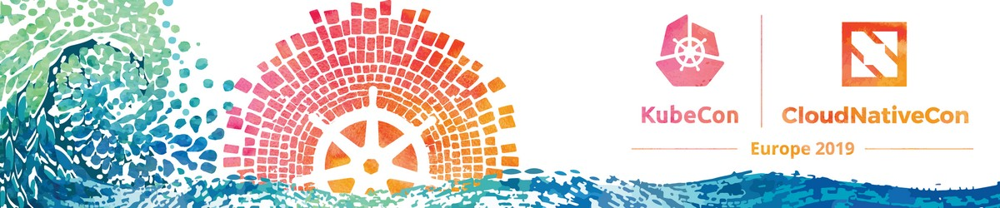

# KubeCon-CloudNativeCon-Europe-2019

### KubeCon-CloudNativeCon-Europe-2019's slides

### This repo hosts published slide files
- The detailed schedule can refer to the event website [KubeCon-CloudNativeCon-Europe-2019](https://events.linuxfoundation.org/events/kubecon-cloudnativecon-europe-2019/).
- And you can find the Video lists of [CNCF YouTube channel (Barcelona '19: KubeCon + CloudNativeCon)](https://www.youtube.com/playlist?list=PLj6h78yzYM2PpmMAnvpvsnR4c27wJePh3) on youtube, enjoy it. 😍

---
### Slides list (TOC):
1. [accelerating-the-journey-of-an-ai-algorithm-to-production-with-openfaas-joost-noppen-bt-plc-alex-ellis-openfaas-ltd.pdf](./accelerating-the-journey-of-an-ai-algorithm-to-production-with-openfaas-joost-noppen-bt-plc-alex-ellis-openfaas-ltd.pdf)
1. [a-tale-of-two-worlds-canary-testing-for-both-ml-models-and-microservices-jorg-schad-arangodb-vincent-lesierse-vampio.pdf](./a-tale-of-two-worlds-canary-testing-for-both-ml-models-and-microservices-jorg-schad-arangodb-vincent-lesierse-vampio.pdf)
1. [autoscaling-multi-cluster-observability-with-thanos-and-linkerd-andrew-seigner-buoyant-frederic-branczyk-red-hat.pdf](./autoscaling-multi-cluster-observability-with-thanos-and-linkerd-andrew-seigner-buoyant-frederic-branczyk-red-hat.pdf)
1. [benchmarking-cloud-native-databases-performance-on-kubernetes-iqbal-farabi-tara-baskara-go-jek.pdf](./benchmarking-cloud-native-databases-performance-on-kubernetes-iqbal-farabi-tara-baskara-go-jek.pdf)
1. [benefits-of-a-service-mesh-when-integrating-kubernetes-with-legacy-services-stephan-fudeus-david-meder-marouelli-11-mail-media-development-technology-gmbh.pdf](./benefits-of-a-service-mesh-when-integrating-kubernetes-with-legacy-services-stephan-fudeus-david-meder-marouelli-11-mail-media-development-technology-gmbh.pdf)
1. [birds-of-a-feather-do-you-really-need-on-premises-serverless-igor-khapov-ibm.pdf](./birds-of-a-feather-do-you-really-need-on-premises-serverless-igor-khapov-ibm.pdf)
1. [birds-of-a-feather-financial-services-user-group-cheryl-hung-cncf.pdf](./birds-of-a-feather-financial-services-user-group-cheryl-hung-cncf.pdf)
1. [birds-of-a-feather-radio-access-network-ltecbrs-edge-john-studarus-packet-host.pdf](./birds-of-a-feather-radio-access-network-ltecbrs-edge-john-studarus-packet-host.pdf)
1. [bof-deep-dive-chaos-engineering-sylvain-hellegouarch-chaosiq.pdf](./bof-deep-dive-chaos-engineering-sylvain-hellegouarch-chaosiq.pdf)
1. [build-a-kubernetes-based-cloud-native-storage-solution-from-scratch-sheng-yang-rancher-labs.pdf](./build-a-kubernetes-based-cloud-native-storage-solution-from-scratch-sheng-yang-rancher-labs.pdf)
1. [building-a-controller-manager-for-your-cloud-platform-fabio-rapposelli-vmware-chris-hoge-openstack-foundation.pdf](./building-a-controller-manager-for-your-cloud-platform-fabio-rapposelli-vmware-chris-hoge-openstack-foundation.pdf)
1. [building-and-maintaining-a-client-library-stories-from-the-trenches-jussi-nummelin-kontena-inc.pdf](./building-and-maintaining-a-client-library-stories-from-the-trenches-jussi-nummelin-kontena-inc.pdf)
1. [building-an-enterprise-ready-lambda-experience-with-hands-on-demo-alexandre-gonzalez-rodriguez-bbva-next-technologies-hector-rodes-lopez-adhara.pdf](./building-an-enterprise-ready-lambda-experience-with-hands-on-demo-alexandre-gonzalez-rodriguez-bbva-next-technologies-hector-rodes-lopez-adhara.pdf)
1. [building-cloud-native-gdpr-friendly-systems-for-data-collection-zsolt-homorodi-vtt.pdf](./building-cloud-native-gdpr-friendly-systems-for-data-collection-zsolt-homorodi-vtt.pdf)
1. [building-ha-multi-cloud-clusters-using-wireguard-as-a-network-overlay-lucas-serven-marin-red-hat.pdf](./building-ha-multi-cloud-clusters-using-wireguard-as-a-network-overlay-lucas-serven-marin-red-hat.pdf)
1. [building-images-efficiently-and-securely-on-kubernetes-with-buildkit-akihiro-suda-ntt-corporation.pdf](./building-images-efficiently-and-securely-on-kubernetes-with-buildkit-akihiro-suda-ntt-corporation.pdf)
1. [caller-id-in-kubernetes-michael-danese-google.pdf](./caller-id-in-kubernetes-michael-danese-google.pdf)
1. [co-evolution-of-kubernetes-and-gcp-networking-purvi-desai-tim-hockin-google.pdf](./co-evolution-of-kubernetes-and-gcp-networking-purvi-desai-tim-hockin-google.pdf)
1. [container-forensics-what-to-do-when-your-cluster-is-a-cluster-maya-kaczorowski-ann-wallace-google.pdf](./container-forensics-what-to-do-when-your-cluster-is-a-cluster-maya-kaczorowski-ann-wallace-google.pdf)
1. [crafty-requests-deep-dive-into-kubernetes-cve-2018-1002105-ian-coldwater-heroku.pdf](./crafty-requests-deep-dive-into-kubernetes-cve-2018-1002105-ian-coldwater-heroku.pdf)
1. [cross-cluster-calls-made-easy-with-istio-11-matt-turner-tetrate.pdf](./cross-cluster-calls-made-easy-with-istio-11-matt-turner-tetrate.pdf)
1. [databases-on-kubernetes-using-a-custom-operator-day-1-day-2-and-beyond-johannes-unterstein-neo4j.pdf](./databases-on-kubernetes-using-a-custom-operator-day-1-day-2-and-beyond-johannes-unterstein-neo4j.pdf)
1. [data-without-borders-using-rook-storage-orchestration-at-a-global-scale-jared-watts-upbound.pdf](./data-without-borders-using-rook-storage-orchestration-at-a-global-scale-jared-watts-upbound.pdf)
1. [dealing-with-the-pesky-path-parameter-problem-service-profiles-alex-leong-buoyant.pdf](./dealing-with-the-pesky-path-parameter-problem-service-profiles-alex-leong-buoyant.pdf)
1. [deconstructing-apache-hadoop-a-dialogue-about-a-cloud-native-refactor-anu-engineer-marton-elek-cloudera.pdf](./deconstructing-apache-hadoop-a-dialogue-about-a-cloud-native-refactor-anu-engineer-marton-elek-cloudera.pdf)
1. [deep-dive-api-machinery-sig-david-eads-red-hat-daniel-smith-google.pdf](./deep-dive-api-machinery-sig-david-eads-red-hat-daniel-smith-google.pdf)
1. [deep-dive-auth-sig-mo-khan-matt-rogers-red-hat.pdf](./deep-dive-auth-sig-mo-khan-matt-rogers-red-hat.pdf)
1. [deep-dive-autoscaling-sig-aleksandra-malinowska-slawomir-chylek-google.pdf](./deep-dive-autoscaling-sig-aleksandra-malinowska-slawomir-chylek-google.pdf)
1. [deep-dive-brigade-radu-matei-microsoft.pdf](./deep-dive-brigade-radu-matei-microsoft.pdf)
1. [deep-dive-cluster-lifecycle-sig-cluster-api-jason-detiberus-vmware-hardik-dodiya-sap.pdf](./deep-dive-cluster-lifecycle-sig-cluster-api-jason-detiberus-vmware-hardik-dodiya-sap.pdf)
1. [deep-dive-cluster-lifecycle-sig-kubeadm-fabrizio-pandini-lubomir-i-ivanov-vmware.pdf](./deep-dive-cluster-lifecycle-sig-kubeadm-fabrizio-pandini-lubomir-i-ivanov-vmware.pdf)
1. [deep-dive-cncf-ci-lucina-stricko-denver-williams-vulk-coop-cncf.pdf](./deep-dive-cncf-ci-lucina-stricko-denver-williams-vulk-coop-cncf.pdf)
1. [deep-dive-cncf-security-sig-justin-cappos-new-york-university-zhipeng-huang-huawei.pdf](./deep-dive-cncf-security-sig-justin-cappos-new-york-university-zhipeng-huang-huawei.pdf)
1. [deep-dive-cncf-serverless-wgcloudevents-clemens-vasters-microsoft-vlad-ionescu-independent.pdf](./deep-dive-cncf-serverless-wgcloudevents-clemens-vasters-microsoft-vlad-ionescu-independent.pdf)
1. [deep-dive-coredns-yong-tang-mobileiron-john-belamaric-google.pdf](./deep-dive-coredns-yong-tang-mobileiron-john-belamaric-google.pdf)
1. [deep-dive-cortex-tom-wilkie-grafana-labs-bryan-boreham-weaveworks.pdf](./deep-dive-cortex-tom-wilkie-grafana-labs-bryan-boreham-weaveworks.pdf)
1. [deep-dive-envoy-lizan-zhou-tetrate.pdf](./deep-dive-envoy-lizan-zhou-tetrate.pdf)
1. [deep-dive-harbor-steven-zou-daniel-jiang-vmware.pptx](./deep-dive-harbor-steven-zou-daniel-jiang-vmware.pptx)
1. [deep-dive-kops-cluster-lifecycle-sig-justin-santa-barbara-google-mike-splain-sonos.pdf](./deep-dive-kops-cluster-lifecycle-sig-justin-santa-barbara-google-mike-splain-sonos.pdf)
1. [deep-dive-kubeedge-cindy-xing-futurewei.pptx](./deep-dive-kubeedge-cindy-xing-futurewei.pptx)
1. [deep-dive-kubernetes-architecture-sig-timothy-st-clair-vmware.pdf](./deep-dive-kubernetes-architecture-sig-timothy-st-clair-vmware.pdf)
1. [deep-dive-kubernetes-metric-apis-using-prometheus-matthias-loibl-sergiusz-urbaniak-red-hat.pdf](./deep-dive-kubernetes-metric-apis-using-prometheus-matthias-loibl-sergiusz-urbaniak-red-hat.pdf)
1. [deep-dive-kubernetes-release-sig-tim-pepper-stephen-augustus-vmware.pdf](./deep-dive-kubernetes-release-sig-tim-pepper-stephen-augustus-vmware.pdf)
1. [deep-dive-kubernetes-ui-sig-jeffrey-sica-university-of-michigan-sebastian-floreks-loodse.pdf](./deep-dive-kubernetes-ui-sig-jeffrey-sica-university-of-michigan-sebastian-floreks-loodse.pdf)
1. [deep-dive-kubernetes-vmware-sig-loc-nguyen-sidharth-surana-vmware.pptx](./deep-dive-kubernetes-vmware-sig-loc-nguyen-sidharth-surana-vmware.pptx)
1. [deep-dive-kubernetes-wg-for-multitenancy-sanjeev-rampal-cisco-ryan-bezdicek-cray-inc.pdf](./deep-dive-kubernetes-wg-for-multitenancy-sanjeev-rampal-cisco-ryan-bezdicek-cray-inc.pdf)
1. [deep-dive-long-term-support-wg-tim-pepper-vmware.pdf](./deep-dive-long-term-support-wg-tim-pepper-vmware.pdf)
1. [deep-dive-nats-waldemar-quevedo-synadia-communications-inc.pdf](./deep-dive-nats-waldemar-quevedo-synadia-communications-inc.pdf)
1. [deep-dive-network-service-mesh-nsm-nikolay-nikolaev-vmware-frederick-kautz-docai.pdf](./deep-dive-network-service-mesh-nsm-nikolay-nikolaev-vmware-frederick-kautz-docai.pdf)
1. [deep-dive-network-sig-tim-hockin-google.pdf](./deep-dive-network-sig-tim-hockin-google.pdf)
1. [deep-dive-open-policy-agent-torin-sandall-tim-hinrichs-styra.pdf](./deep-dive-open-policy-agent-torin-sandall-tim-hinrichs-styra.pdf)
1. [deep-dive-rook-jared-watts-bassam-tabbara-upbound.pdf](./deep-dive-rook-jared-watts-bassam-tabbara-upbound.pdf)
1. [deep-dive-scheduling-sig-babak-salamat-google.pdf](./deep-dive-scheduling-sig-babak-salamat-google.pdf)
1. [deep-dive-service-catalog-sig-jonathan-berkhahn-ibm.pdf](./deep-dive-service-catalog-sig-jonathan-berkhahn-ibm.pdf)
1. [deep-dive-spiffe-scott-emmons-emiliano-bernbaum-scytale.pdf](./deep-dive-spiffe-scott-emmons-emiliano-bernbaum-scytale.pdf)
1. [deep-dive-tuf-notary-justin-cappos-lukas-puehringer-nyu.pdf](./deep-dive-tuf-notary-justin-cappos-lukas-puehringer-nyu.pdf)
1. [deep-dive-virtual-kubelet-jeremy-rickard-microsoft-lei-zhang-alibaba-cloud.pptx](./deep-dive-virtual-kubelet-jeremy-rickard-microsoft-lei-zhang-alibaba-cloud.pptx)
1. [delivering-serverless-experience-on-kubernetes-beyond-web-applications-alex-glikson-carnegie-mellon-university.pdf](./delivering-serverless-experience-on-kubernetes-beyond-web-applications-alex-glikson-carnegie-mellon-university.pdf)
1. [delivering-tv-everywhere-with-cloud-native-solutions-arnaud-caron-jerome-champetier-mediakind.pdf](./delivering-tv-everywhere-with-cloud-native-solutions-arnaud-caron-jerome-champetier-mediakind.pdf)
1. [democratizing-mysql-from-cloud-managed-to-kubernetes-managed-sachin-manpathak-platform9-flavius-mecea-presslabs-srl.pdf](./democratizing-mysql-from-cloud-managed-to-kubernetes-managed-sachin-manpathak-platform9-flavius-mecea-presslabs-srl.pdf)
1. [deploy-scale-and-extend-jaeger-louis-etienne-dorval-ticketmaster.pdf](./deploy-scale-and-extend-jaeger-louis-etienne-dorval-ticketmaster.pdf)
1. [economics-and-best-practices-of-running-aiml-workloads-on-kubernetes-maulin-patel-google-yaron-haviv-iguazio.pdf](./economics-and-best-practices-of-running-aiml-workloads-on-kubernetes-maulin-patel-google-yaron-haviv-iguazio.pdf)
1. [edgility-5g-orchestration-in-serverless-edge-cloud-native-environments-eden-pierre-rozin-att.pdf](./edgility-5g-orchestration-in-serverless-edge-cloud-native-environments-eden-pierre-rozin-att.pdf)
1. [embracing-upstream-kubernetes-in-web-scale-organization-lei-zhang-alibaba-jun-chen-ant-financial.pdf](./embracing-upstream-kubernetes-in-web-scale-organization-lei-zhang-alibaba-jun-chen-ant-financial.pdf)
1. [envoy-sds-fortifying-istio-security-yonggang-liu-quanjie-lin-google.pdf](./envoy-sds-fortifying-istio-security-yonggang-liu-quanjie-lin-google.pdf)
1. [es-operator-building-an-elasticsearch-operator-from-the-bottom-up-mikkel-larsen-zalando-se.pdf](./es-operator-building-an-elasticsearch-operator-from-the-bottom-up-mikkel-larsen-zalando-se.pdf)
1. [extending-envoy-with-webassembly-john-plevyak-dhi-aurrahman-tetrate.pdf](./extending-envoy-with-webassembly-john-plevyak-dhi-aurrahman-tetrate.pdf)
1. [extending-knative-for-fun-and-profit-matt-moore-ville-aikas-google.pdf](./extending-knative-for-fun-and-profit-matt-moore-ville-aikas-google.pdf)
1. [faas-is-not-only-the-serverless-stream-processing-with-serverless-jun-makishi-kensaku-komatsu-ntt-communications.pdf](./faas-is-not-only-the-serverless-stream-processing-with-serverless-jun-makishi-kensaku-komatsu-ntt-communications.pdf)
1. [fine-grained-permissions-in-kubernetes-whats-missing-and-how-to-fix-that-vallery-lancey-lyft-seth-mccombs-triller.pdf](./fine-grained-permissions-in-kubernetes-whats-missing-and-how-to-fix-that-vallery-lancey-lyft-seth-mccombs-triller.pdf)
1. [from-new-cluster-to-insight-deploying-monitoring-and-logging-to-kubernetes-eddie-zaneski-digitalocean.pdf](./from-new-cluster-to-insight-deploying-monitoring-and-logging-to-kubernetes-eddie-zaneski-digitalocean.pdf)
1. [from-snowflake-servers-to-snowflake-clusters-the-gitops-journey-allison-richardet-asteris-llc-fabio-giannetti-mastercard.pdf](./from-snowflake-servers-to-snowflake-clusters-the-gitops-journey-allison-richardet-asteris-llc-fabio-giannetti-mastercard.pdf)
1. [going-from-5s-to-5ms-benefits-of-a-node-local-dnscache-pavithra-ramesh-google-blake-barnett-postmates.pdf](./going-from-5s-to-5ms-benefits-of-a-node-local-dnscache-pavithra-ramesh-google-blake-barnett-postmates.pdf)
1. [gpu-machine-learning-from-laptop-to-cloud-mark-puddick-pivotal.pdf](./gpu-machine-learning-from-laptop-to-cloud-mark-puddick-pivotal.pdf)
1. [gpu-sharing-for-machine-learning-workload-on-kubernetes-henry-zhang-yang-yu-vmware.pdf](./gpu-sharing-for-machine-learning-workload-on-kubernetes-henry-zhang-yang-yu-vmware.pdf)
1. [grafana-loki-like-prometheus-but-for-logs-tom-wilkie-grafana-labs.pdf](./grafana-loki-like-prometheus-but-for-logs-tom-wilkie-grafana-labs.pdf)
1. [grpc-load-balancing-and-service-mesh-vishal-powar-google.pdf](./grpc-load-balancing-and-service-mesh-vishal-powar-google.pdf)
1. [helm-3-navigating-to-distant-shores-bridget-kromhout-jessica-deen-microsoft.txt](./helm-3-navigating-to-distant-shores-bridget-kromhout-jessica-deen-microsoft.txt)
1. [high-performance-networking-with-kubevirt-doug-smith-red-hat-abdul-halim-intel.pdf](./high-performance-networking-with-kubevirt-doug-smith-red-hat-abdul-halim-intel.pdf)
1. [how-does-google-release-kubernetes-in-gke-kobi-magnezi-josh-hoak-google.pdf](./how-does-google-release-kubernetes-in-gke-kobi-magnezi-josh-hoak-google.pdf)
1. [how-intuit-does-canary-and-blue-green-deployments-with-a-k8s-controller-daniel-thomson-alex-matyushentsev-intuit.pdf](./how-intuit-does-canary-and-blue-green-deployments-with-a-k8s-controller-daniel-thomson-alex-matyushentsev-intuit.pdf)
1. [how-liveperson-is-tailoring-its-conversational-platform-using-openfaas-simon-pelczer-liveperson-ivana-yovcheva-vmware.pdf](./how-liveperson-is-tailoring-its-conversational-platform-using-openfaas-simon-pelczer-liveperson-ivana-yovcheva-vmware.pdf)
1. [how-to-create-kubernetes-experts-clarke-vennerbeck-aaron-teague-supergiant.pptx](./how-to-create-kubernetes-experts-clarke-vennerbeck-aaron-teague-supergiant.pptx)
1. [how-we-used-kubernetes-to-host-a-capture-the-flag-ctf-ariel-zelivansky-liron-levin-twistlock.pdf](./how-we-used-kubernetes-to-host-a-capture-the-flag-ctf-ariel-zelivansky-liron-levin-twistlock.pdf)
1. [improving-availability-for-stateful-applications-in-kubernetes-michelle-au-google.pdf](./improving-availability-for-stateful-applications-in-kubernetes-michelle-au-google.pdf)
1. [infrastructure-as-software-paul-jones-dyson.pdf](./infrastructure-as-software-paul-jones-dyson.pdf)
1. [inside-the-cncf-project-security-reviews-justin-cormack-docker.pdf](./inside-the-cncf-project-security-reviews-justin-cormack-docker.pdf)
1. [intro-brigade-radu-matei-microsoft.pdf](./intro-brigade-radu-matei-microsoft.pdf)
1. [intro-cli-sig-maciej-szulik-red-hat-phillip-wittrock-google.pdf](./intro-cli-sig-maciej-szulik-red-hat-phillip-wittrock-google.pdf)
1. [intro-cluster-lifecycle-sig-lucas-kaldstrom-independent-tim-st-clair-vmware.pdf](./intro-cluster-lifecycle-sig-lucas-kaldstrom-independent-tim-st-clair-vmware.pdf)
1. [intro-cncf-ci-lucina-stricko-denver-williams-vulk-coop-cncf.pdf](./intro-cncf-ci-lucina-stricko-denver-williams-vulk-coop-cncf.pdf)
1. [intro-cncf-security-sig-sarah-allen-jeyappragash-jeyakeerthi-tetrateio.pdf](./intro-cncf-security-sig-sarah-allen-jeyappragash-jeyakeerthi-tetrateio.pdf)
1. [intro-coredns-daniel-garcia-infoblox-michael-grosser-okkur-labs.pdf](./intro-coredns-daniel-garcia-infoblox-michael-grosser-okkur-labs.pdf)
1. [intro-cortex-tom-wilkie-grafana-labs-bryan-boreham-weaveworks.pdf](./intro-cortex-tom-wilkie-grafana-labs-bryan-boreham-weaveworks.pdf)
1. [intro-deep-dive-containerd-wei-fu-alibaba-mike-brown-ibm.pdf](./intro-deep-dive-containerd-wei-fu-alibaba-mike-brown-ibm.pdf)
1. [intro-deep-dive-ibmcloud-sig-sahdev-p-zala-khalid-ahmed-brad-topol-nimesh-bhatia-ibm.pdf](./intro-deep-dive-ibmcloud-sig-sahdev-p-zala-khalid-ahmed-brad-topol-nimesh-bhatia-ibm.pdf)
1. [intro-deep-dive-kubernetes-docs-sig-zach-corleissen-linux-foundation-rael-garcia-capside.pdf](./intro-deep-dive-kubernetes-docs-sig-zach-corleissen-linux-foundation-rael-garcia-capside.pdf)
1. [intro-deep-dive-kubernetes-iot-edge-wg-steven-wong-vmware-dejan-bosanac-red-hat-kilton-hopkins-edgeworx.pdf](./intro-deep-dive-kubernetes-iot-edge-wg-steven-wong-vmware-dejan-bosanac-red-hat-kilton-hopkins-edgeworx.pdf)
1. [intro-deep-dive-kubernetes-policy-wg-zhipeng-huang-huawei-erica-von-buelow-red-hat.pdf](./intro-deep-dive-kubernetes-policy-wg-zhipeng-huang-huawei-erica-von-buelow-red-hat.pdf)
1. [intro-deep-dive-prometheus-julius-volz-prometheus-richard-hartmann-spacenet.pdf](./intro-deep-dive-prometheus-julius-volz-prometheus-richard-hartmann-spacenet.pdf)
1. [intro-deep-dive-serverless-wg-scott-nichols-google-doug-davis-ibm.pdf](./intro-deep-dive-serverless-wg-scott-nichols-google-doug-davis-ibm.pdf)
1. [intro-deep-dive-windows-sig-michael-michael-vmware-patrick-lang-microsoft.pptx](./intro-deep-dive-windows-sig-michael-michael-vmware-patrick-lang-microsoft.pptx)
1. [intro-dragonfly-allen-sun-zuozheng-hu-alibaba-cloud.pptx](./intro-dragonfly-allen-sun-zuozheng-hu-alibaba-cloud.pptx)
1. [intro-envoy-lizan-zhou-tetrate.pdf](./intro-envoy-lizan-zhou-tetrate.pdf)
1. [intro-harbor-henry-zhang-steven-ren-vmware.pdf](./intro-harbor-henry-zhang-steven-ren-vmware.pdf)
1. [intro-kubeedge-cindy-xing-futurewei-dejan-bosanac-red-hat.pptx](./intro-kubeedge-cindy-xing-futurewei-dejan-bosanac-red-hat.pptx)
1. [intro-kubernetes-aws-sig-justin-santa-barbara-google.pdf](./intro-kubernetes-aws-sig-justin-santa-barbara-google.pdf)
1. [intro-kubernetes-release-sig-tim-pepper-vmware-claire-laurence-pivotal.pdf](./intro-kubernetes-release-sig-tim-pepper-vmware-claire-laurence-pivotal.pdf)
1. [intro-kubernetes-vmware-sig-david-vonthenen-steven-wong-vmware.pdf](./intro-kubernetes-vmware-sig-david-vonthenen-steven-wong-vmware.pdf)
1. [intro-linkerd-william-morgan-buoyant.pdf](./intro-linkerd-william-morgan-buoyant.pdf)
1. [intro-nats-waldemar-quevedo-synadia-communications-inc.pdf](./intro-nats-waldemar-quevedo-synadia-communications-inc.pdf)
1. [intro-open-policy-agent-rita-zhang-microsoft-max-smythe-google.pdf](./intro-open-policy-agent-rita-zhang-microsoft-max-smythe-google.pdf)
1. [intro-rook-alexander-trost-cloudibility-travis-nielsen-red-hat.pdf](./intro-rook-alexander-trost-cloudibility-travis-nielsen-red-hat.pdf)
1. [intro-service-catalog-sig-jonathan-berkhahn-ibm.pdf](./intro-service-catalog-sig-jonathan-berkhahn-ibm.pdf)
1. [intro-spiffe-emiliano-bernbaum-scott-emmons-scytale.pdf](./intro-spiffe-emiliano-bernbaum-scott-emmons-scytale.pdf)
1. [intro-testing-sig-cole-wagner-aishwarya-sundar-google.pdf](./intro-testing-sig-cole-wagner-aishwarya-sundar-google.pdf)
1. [intro-to-cnab-packaging-cloud-native-applications-with-multiple-toolchains-chris-crone-docker.pdf](./intro-to-cnab-packaging-cloud-native-applications-with-multiple-toolchains-chris-crone-docker.pdf)
1. [intro-virtual-kubelet-ria-bhatia-microsoft-anubhav-mishra-hashiCorp.pdf](./intro-virtual-kubelet-ria-bhatia-microsoft-anubhav-mishra-hashiCorp.pdf)
1. [intro-vitess-sugu-sougoumarane-deepthi-sigireddi-planetscale.pdf](./intro-vitess-sugu-sougoumarane-deepthi-sigireddi-planetscale.pdf)
1. [istio-multi-cluster-service-mesh-patterns-explained-daniel-berg-ram-vennam-ibm.pdf](./istio-multi-cluster-service-mesh-patterns-explained-daniel-berg-ram-vennam-ibm.pdf)
1. [istio-new-workload-identity-provision-pipeline-based-on-envoy-sds-quanjie-lin-diem-vu-google.pdf](./istio-new-workload-identity-provision-pipeline-based-on-envoy-sds-quanjie-lin-diem-vu-google.pdf)
1. [istio-on-knative-lessons-learned-how-istio-is-fit-for-serverless-platform-ying-chun-guo-iris-ding-ibm.pdf](./istio-on-knative-lessons-learned-how-istio-is-fit-for-serverless-platform-ying-chun-guo-iris-ding-ibm.pdf)
1. [justfootballs-journey-to-grpc-linkerd-in-production-ben-lambert-justfootball-kevin-lingerfelt-buoyant.pdf](./justfootballs-journey-to-grpc-linkerd-in-production-ben-lambert-justfootball-kevin-lingerfelt-buoyant.pdf)
1. [kanary-automated-and-integrated-canary-testing-using-crd-and-an-operator-david-benque-amadeus-cedric-lamoriniere-datadog.pdf](./kanary-automated-and-integrated-canary-testing-using-crd-and-an-operator-david-benque-amadeus-cedric-lamoriniere-datadog.pdf)
1. [keep-the-space-shuttle-flying-writing-robust-operators-illya-chekrygin-upbound.pdf](./keep-the-space-shuttle-flying-writing-robust-operators-illya-chekrygin-upbound.pdf)
1. [keps-evolving-kubernetes-at-the-speed-of-trust-caleb-miles-google.pdf](./keps-evolving-kubernetes-at-the-speed-of-trust-caleb-miles-google.pdf)
1. [keynote-metrics-logs-traces-what-does-the-future-hold-for-observability-tom-wilkie-vp-product-grafana-labs-frederic-branczyk-software-engineer-red-hat.pdf](./keynote-metrics-logs-traces-what-does-the-future-hold-for-observability-tom-wilkie-vp-product-grafana-labs-frederic-branczyk-software-engineer-red-hat.pdf)
1. [keynote-stitching-things-together-dan-kohn-executive-director-cloud-native-computing-foundation.pptx](./keynote-stitching-things-together-dan-kohn-executive-director-cloud-native-computing-foundation.pptx)
1. [koping-with-change-what-kops-learned-adopting-etcd3-cluster-api-and-crds-justin-santa-barbara-google-mike-splain-sonos.pdf](./koping-with-change-what-kops-learned-adopting-etcd3-cluster-api-and-crds-justin-santa-barbara-google-mike-splain-sonos.pdf)
1. [kubernetes-encrypted-memory-security-privacy-harshal-patil-pradipta-banerjee-ibm.pdf](./kubernetes-encrypted-memory-security-privacy-harshal-patil-pradipta-banerjee-ibm.pdf)
1. [kubernetes-failure-stories-and-how-to-crash-your-clusters-henning-jacobs-zalando-se.pdf](./kubernetes-failure-stories-and-how-to-crash-your-clusters-henning-jacobs-zalando-se.pdf)
1. [kubernetes-networking-at-scale-laurent-bernaille-datadog-bowei-du-google.pdf](./kubernetes-networking-at-scale-laurent-bernaille-datadog-bowei-du-google.pdf)
1. [kubernetes-networking-how-to-write-a-cni-plugin-from-scratch-eran-yanay-twistlock.pdf](./kubernetes-networking-how-to-write-a-cni-plugin-from-scratch-eran-yanay-twistlock.pdf)
1. [kubernetes-scalability-definition-evolution-wojciech-tyczynski-andrzej-wasylkowski-google.pdf](./kubernetes-scalability-definition-evolution-wojciech-tyczynski-andrzej-wasylkowski-google.pdf)
1. [kubernetes-security-and-how-to-fix-k8s-cluster-at-scale-simon-pearce-syseleven-sebastian-scheele-loodse.pdf](./kubernetes-security-and-how-to-fix-k8s-cluster-at-scale-simon-pearce-syseleven-sebastian-scheele-loodse.pdf)
1. [kubernetes-storage-101-jan-safranek-red-hat-david-zhu-google.pdf](./kubernetes-storage-101-jan-safranek-red-hat-david-zhu-google.pdf)
1. [kubernetes-the-new-research-platform-lindsey-tulloch-brock-university-bob-killen-university-of-michigan.pdf](./kubernetes-the-new-research-platform-lindsey-tulloch-brock-university-bob-killen-university-of-michigan.pdf)
1. [large-scale-distributed-deep-learning-with-kubernetes-operators-yuan-tang-ant-financial-yong-tang-mobileiron.pdf](./large-scale-distributed-deep-learning-with-kubernetes-operators-yuan-tang-ant-financial-yong-tang-mobileiron.pdf)
1. [large-synoptic-survey-telescope-from-cloud-native-to-dark-energy-fabrice-jammes-lsst-corporation-french-national-institute-of-nuclear-and-particle-physics-in2p3.pdf](./large-synoptic-survey-telescope-from-cloud-native-to-dark-energy-fabrice-jammes-lsst-corporation-french-national-institute-of-nuclear-and-particle-physics-in2p3.pdf)
1. [latest-kubernetes-scalability-improvements-shyam-jeedigunta-amazon-yassine-tijani-vmware.pdf](./latest-kubernetes-scalability-improvements-shyam-jeedigunta-amazon-yassine-tijani-vmware.pdf)
1. [laying-the-foundation-real-world-kubernetes-deployment-patterns-josh-rosso-craig-tracey-vmware.pdf](./laying-the-foundation-real-world-kubernetes-deployment-patterns-josh-rosso-craig-tracey-vmware.pdf)
1. [learn-how-to-leverage-kubernetes-to-support-12-factor-for-enterprise-apps-brad-topol-michael-elder-ibm.pdf](./learn-how-to-leverage-kubernetes-to-support-12-factor-for-enterprise-apps-brad-topol-michael-elder-ibm.pdf)
1. [lessons-learned-migrating-kubernetes-from-docker-to-containerd-runtime-ana-calin-paybase.pdf](./lessons-learned-migrating-kubernetes-from-docker-to-containerd-runtime-ana-calin-paybase.pdf)
1. [lets-try-every-cri-runtime-available-for-kubernetes-no-really-phil-estes-ibm.pdf](./lets-try-every-cri-runtime-available-for-kubernetes-no-really-phil-estes-ibm.pdf)
1. [lifecycle-of-a-kubectl-command-harden-kubernetes-setup-with-automation-sanjary-rahman-bookingcom.pdf](./lifecycle-of-a-kubectl-command-harden-kubernetes-setup-with-automation-sanjary-rahman-bookingcom.pdf)
1. [lightning-talk-back-to-the-future-with-ebpf-beatriz-martinez-rubio-ibm.pdf](./lightning-talk-back-to-the-future-with-ebpf-beatriz-martinez-rubio-ibm.pdf)
1. [lightning-talk-beyond-operators-reimagine-distributed-applications-on-kubernetes-vladimir-vivien-vmware.pdf](./lightning-talk-beyond-operators-reimagine-distributed-applications-on-kubernetes-vladimir-vivien-vmware.pdf)
1. [lightning-talk-fake-it-until-you-make-it-unit-tests-with-go-client-fake-client-fernando-diaz-ibm.pdf](./lightning-talk-fake-it-until-you-make-it-unit-tests-with-go-client-fake-client-fernando-diaz-ibm.pdf)
1. [lightning-talk-hot-fresh-containers-how-containers-are-like-cookies-kaslin-fields-oracle.pdf](./lightning-talk-hot-fresh-containers-how-containers-are-like-cookies-kaslin-fields-oracle.pdf)
1. [lightning-talk-how-to-regain-the-trust-of-your-users-eduard-iacoboaia-bookingcom.pdf](./lightning-talk-how-to-regain-the-trust-of-your-users-eduard-iacoboaia-bookingcom.pdf)
1. [lightning-talk-kubernetes-jobs-and-the-sidecar-problem-james-wen-spotify.pdf](./lightning-talk-kubernetes-jobs-and-the-sidecar-problem-james-wen-spotify.pdf)
1. [lightning-talk-managing-drivers-in-a-kubernetes-cluster-renaud-gaubert-nvidia.pdf](./lightning-talk-managing-drivers-in-a-kubernetes-cluster-renaud-gaubert-nvidia.pdf)
1. [lightning-talk-oh-sht-the-config-changed-joel-speed-pusher.pdf](./lightning-talk-oh-sht-the-config-changed-joel-speed-pusher.pdf)
1. [lightning-talk-ready-steady-cka-olive-power-vmware.pdf](./lightning-talk-ready-steady-cka-olive-power-vmware.pdf)
1. [lightning-talk-reliability-engineering-for-humans-hannah-foxwell-pivotal.pdf](./lightning-talk-reliability-engineering-for-humans-hannah-foxwell-pivotal.pdf)
1. [lightning-talk-slow-starting-containers-how-to-check-their-health-matthias-bertschy-swissquote-bank.pdf](./lightning-talk-slow-starting-containers-how-to-check-their-health-matthias-bertschy-swissquote-bank.pdf)
1. [lightning-talk-using-istios-mixer-for-network-request-caching-zach-arnold-ygrene-energy-fund.pdf](./lightning-talk-using-istios-mixer-for-network-request-caching-zach-arnold-ygrene-energy-fund.pdf)
1. [lightning-talk-using-jupyter-notebooks-to-gain-insight-of-your-cluster-ruben-d-orduz-vmware.pdf](./lightning-talk-using-jupyter-notebooks-to-gain-insight-of-your-cluster-ruben-d-orduz-vmware.pdf)
1. [lightning-talk-when-the-command-line-is-not-enough-why-your-oss-project-needs-a-gui-risha-mars-buoyant.pdf](./lightning-talk-when-the-command-line-is-not-enough-why-your-oss-project-needs-a-gui-risha-mars-buoyant.pdf)
1. [m3-and-prometheus-monitoring-at-planet-scale-for-everyone-rob-skillington-uber.pdf](./m3-and-prometheus-monitoring-at-planet-scale-for-everyone-rob-skillington-uber.pdf)
1. [managing-crds-and-operators-in-practice-zhen-zhang-alibaba-wei-guo-ant-financial.pdf](./managing-crds-and-operators-in-practice-zhen-zhang-alibaba-wei-guo-ant-financial.pdf)
1. [managing-edge-computing-with-serverless-lev-radomislensky-iguazio.pdf](./managing-edge-computing-with-serverless-lev-radomislensky-iguazio.pdf)
1. [mental-health-in-tech-dr-jennifer-akullian-growth-coaching-institute.pdf](./mental-health-in-tech-dr-jennifer-akullian-growth-coaching-institute.pdf)
1. [merging-quickly-in-a-cloud-native-world-lucas-roesler-contiamo.pdf](./merging-quickly-in-a-cloud-native-world-lucas-roesler-contiamo.pdf)
1. [microservices-for-the-masses-integrating-a-distributed-os-with-kubernetes-quinton-hoole-futurewei-irene-zhang-microsoft-research-university-of-washington.pdf](./microservices-for-the-masses-integrating-a-distributed-os-with-kubernetes-quinton-hoole-futurewei-irene-zhang-microsoft-research-university-of-washington.pdf)
1. [migrating-south-east-asias-biggest-payments-company-to-kubernetes-akashdeep-singh-go-jek-abhishek-sangwan-mavenhive-technologies.pdf](./migrating-south-east-asias-biggest-payments-company-to-kubernetes-akashdeep-singh-go-jek-abhishek-sangwan-mavenhive-technologies.pdf)
1. [monitoring-service-architecture-and-health-with-bpf-jonathan-perry-flowmill-inc.pdf](./monitoring-service-architecture-and-health-with-bpf-jonathan-perry-flowmill-inc.pdf)
1. [moving-people-and-products-with-machine-learning-on-kubeflow-jeremy-lewi-google-willem-pienaar-go-jek.pdf](./moving-people-and-products-with-machine-learning-on-kubeflow-jeremy-lewi-google-willem-pienaar-go-jek.pdf)
1. [navigating-the-cloud-native-community-for-end-users-cheryl-hung-cncf.pdf](./navigating-the-cloud-native-community-for-end-users-cheryl-hung-cncf.pdf)
1. [networking-the-service-mesh-proxy-where-we-are-where-were-going-tim-swanson-john-joyce-cisco.pdf](./networking-the-service-mesh-proxy-where-we-are-where-were-going-tim-swanson-john-joyce-cisco.pdf)
1. [network-machinery-a-united-front-for-network-troubleshooting-with-crds-adel-zaalouk-sap.pdf](./network-machinery-a-united-front-for-network-troubleshooting-with-crds-adel-zaalouk-sap.pdf)
1. [network-observability-with-ipfix-prometheus-and-elastic-stack-rastislav-szabo-pantheon-technologies.pdf](./network-observability-with-ipfix-prometheus-and-elastic-stack-rastislav-szabo-pantheon-technologies.pdf)
1. [oopsi-did-it-again-i-reinvented-grpc-austin-lamon-dave-zolotusky-spotify.pdf](./oopsi-did-it-again-i-reinvented-grpc-austin-lamon-dave-zolotusky-spotify.pdf)
1. [openapi-specs-towards-native-user-experience-of-crds-stefan-schimanski-red-hat.pdf](./openapi-specs-towards-native-user-experience-of-crds-stefan-schimanski-red-hat.pdf)
1. [operating-kube-apiserver-without-hiccups-stefan-schimanski-david-eads-red-hat.pdf](./operating-kube-apiserver-without-hiccups-stefan-schimanski-david-eads-red-hat.pdf)
1. [ouch-what-i-learned-from-being-hit-by-a-serverless-ruby-boomerang-ewan-slater-oracle.pdf](./ouch-what-i-learned-from-being-hit-by-a-serverless-ruby-boomerang-ewan-slater-oracle.pdf)
1. [p2p-docker-image-distribution-in-hybrid-cloud-environment-with-kraken-yiran-wang-cody-gibb-uber.pdf](./p2p-docker-image-distribution-in-hybrid-cloud-environment-with-kraken-yiran-wang-cody-gibb-uber.pdf)
1. [panel-discussion-democratizing-hpc-ai-startups-scale-up-with-cloud-native-emily-tanaka-delgado-oracle-charlie-davies-igeolise-priya-shah-sauce-ant-kennedy-gapsquare-and-alfonso-santiago-elem.pdf](./panel-discussion-democratizing-hpc-ai-startups-scale-up-with-cloud-native-emily-tanaka-delgado-oracle-charlie-davies-igeolise-priya-shah-sauce-ant-kennedy-gapsquare-and-alfonso-santiago-elem.pdf)
1. [peribolos-how-kubernetes-uses-gitops-to-manage-github-communities-at-scale-christoph-blecker-red-hat-erick-fejta-google.pdf](./peribolos-how-kubernetes-uses-gitops-to-manage-github-communities-at-scale-christoph-blecker-red-hat-erick-fejta-google.pdf)
1. [portable-universal-single-sign-on-for-your-clusters-miguel-martinez-bitnami.pdf](./portable-universal-single-sign-on-for-your-clusters-miguel-martinez-bitnami.pdf)
1. [protecting-the-data-lake-ash-narkar-styra-inc.pdf](./protecting-the-data-lake-ash-narkar-styra-inc.pdf)
1. [ready-a-deep-dive-into-pod-readiness-gates-for-service-health-management-minhan-xia-google-ping-zou-intuit.pdf](./ready-a-deep-dive-into-pod-readiness-gates-for-service-health-management-minhan-xia-google-ping-zou-intuit.pdf)
1. [reenforce-kubernetes-image-isolation-in-multi-tenant-service-eric-lin-alibaba.pdf](./reenforce-kubernetes-image-isolation-in-multi-tenant-service-eric-lin-alibaba.pdf)
1. [reinventing-networking-a-deep-dive-into-istios-multicluster-gateways-steve-dake-independent.pdf](./reinventing-networking-a-deep-dive-into-istios-multicluster-gateways-steve-dake-independent.pdf)
1. [repeatable-deployments-with-kubernetes-helm-bazel-rohan-singh-hustle-inc.pdf](./repeatable-deployments-with-kubernetes-helm-bazel-rohan-singh-hustle-inc.pdf)
1. [reproducible-development-and-deployment-with-bazel-and-telepresence-christian-roggia-engel-volkers-technology-gmbh.pdf](./reproducible-development-and-deployment-with-bazel-and-telepresence-christian-roggia-engel-volkers-technology-gmbh.pdf)
1. [resize-your-pods-wo-disruptions-aka-how-to-have-a-cake-and-eat-a-cake-karol-golab-beata-skiba-google.pdf](./resize-your-pods-wo-disruptions-aka-how-to-have-a-cake-and-eat-a-cake-karol-golab-beata-skiba-google.pdf)
1. [rootless-reproducible-and-hermetic-secure-container-build-showdown-andrew-martin-control-plane.pdf](./rootless-reproducible-and-hermetic-secure-container-build-showdown-andrew-martin-control-plane.pdf)
1. [running-ebays-high-performance-workloads-with-kubernetes-xin-ma-ebay.pdf](./running-ebays-high-performance-workloads-with-kubernetes-xin-ma-ebay.pdf)
1. [running-kubernetes-on-ephemeral-infrastructure-greg-dearment-vlad-ungureanu-palantir-technologies.pdf](./running-kubernetes-on-ephemeral-infrastructure-greg-dearment-vlad-ungureanu-palantir-technologies.pdf)
1. [scale-kubernetes-service-endpoints-100x-minhan-xia-wojciech-tyczynski-google.pdf](./scale-kubernetes-service-endpoints-100x-minhan-xia-wojciech-tyczynski-google.pdf)
1. [scaling-and-securing-spark-on-kubernetes-at-bloomberg-ilan-filonenko-bloomberg.pdf](./scaling-and-securing-spark-on-kubernetes-at-bloomberg-ilan-filonenko-bloomberg.pdf)
1. [scaling-edge-operations-at-onefootball-with-ambassador-from-0-to-6000-rps-jonathan-juares-beber-rodrigo-del-monte-onefootball-gmbh.pdf](./scaling-edge-operations-at-onefootball-with-ambassador-from-0-to-6000-rps-jonathan-juares-beber-rodrigo-del-monte-onefootball-gmbh.pdf)
1. [scavenging-for-reusable-code-in-the-kubernetes-codebase-kevin-lingerfelt-buoyant.pdf](./scavenging-for-reusable-code-in-the-kubernetes-codebase-kevin-lingerfelt-buoyant.pdf)
1. [secrets-store-csi-driver-bring-your-own-enterprise-secrets-store-to-k8s-rita-zhang-microsoft-anubhav-mishra-hashicorp.pdf](./secrets-store-csi-driver-bring-your-own-enterprise-secrets-store-to-k8s-rita-zhang-microsoft-anubhav-mishra-hashicorp.pdf)
1. [serverless-is-interesting-but-faas-is-not-enough-jonas-boner-lightbend-inc.pdf](./serverless-is-interesting-but-faas-is-not-enough-jonas-boner-lightbend-inc.pdf)
1. [sharing-is-caring-your-kubernetes-cluster-namespaces-and-you-amy-chen-eryn-muetzel-vmware.pdf](./sharing-is-caring-your-kubernetes-cluster-namespaces-and-you-amy-chen-eryn-muetzel-vmware.pdf)
1. [smarter-kubernetes-access-control-a-simpler-approach-to-auth-rob-scott-reactiveops.pdf](./smarter-kubernetes-access-control-a-simpler-approach-to-auth-rob-scott-reactiveops.pdf)
1. [strategies-to-kubernetify-legacy-applications-sai-vennam-ibm.pdf](./strategies-to-kubernetify-legacy-applications-sai-vennam-ibm.pdf)
1. [streamlining-kubernetes-application-cicd-with-bazel-gregg-donovan-etsycom-inc-chris-love-cnm-consulting.pdf](./streamlining-kubernetes-application-cicd-with-bazel-gregg-donovan-etsycom-inc-chris-love-cnm-consulting.pdf)
1. [surviving-serverless-battle-by-secure-runtime-cri-and-runtimeclass-xiaoyu-zhang-lei-zhang-alibaba.pdf](./surviving-serverless-battle-by-secure-runtime-cri-and-runtimeclass-xiaoyu-zhang-lei-zhang-alibaba.pdf)
1. [tailor-made-security-building-a-kubernetes-specific-hypervisor-samuel-ortiz-intel-andreea-florescu-amazon.pdf](./tailor-made-security-building-a-kubernetes-specific-hypervisor-samuel-ortiz-intel-andreea-florescu-amazon.pdf)
1. [the-data-analytics-platform-or-how-to-make-data-science-in-a-box-possible-krzysztof-adamski-rob-keevil-ing.pdf](./the-data-analytics-platform-or-how-to-make-data-science-in-a-box-possible-krzysztof-adamski-rob-keevil-ing.pdf)
1. [the-kubernetes-control-plane-for-busy-people-who-like-pictures-daniel-smith-google.pdf](./the-kubernetes-control-plane-for-busy-people-who-like-pictures-daniel-smith-google.pdf)
1. [the-multicluster-toolbox-adrien-trouillaud-admiralty.pdf](./the-multicluster-toolbox-adrien-trouillaud-admiralty.pdf)
1. [the-serverless-landscape-and-event-driven-futures-dee-kumar-cncf-arun-gupta-aws.pdf](./the-serverless-landscape-and-event-driven-futures-dee-kumar-cncf-arun-gupta-aws.pdf)
1. [the-spotify-story-moving-from-nih-to-an-active-cncf-community-member-jim-haughwout-spotify.pptx](./the-spotify-story-moving-from-nih-to-an-active-cncf-community-member-jim-haughwout-spotify.pptx)
1. [the-story-of-why-we-migrate-to-grpc-and-how-we-go-about-it-matthias-gruter-spotify.pdf](./the-story-of-why-we-migrate-to-grpc-and-how-we-go-about-it-matthias-gruter-spotify.pdf)
1. [towards-kubeflow-10-bringing-a-cloud-native-platform-for-ml-to-kubernetes-david-aronchick-microsoft-jeremy-lewi-google.pdf](./towards-kubeflow-10-bringing-a-cloud-native-platform-for-ml-to-kubernetes-david-aronchick-microsoft-jeremy-lewi-google.pdf)
1. [tracing-is-more-than-traces-the-insights-in-trace-aggregates-daniela-miao-lightstep.pdf](./tracing-is-more-than-traces-the-insights-in-trace-aggregates-daniela-miao-lightstep.pdf)
1. [treating-network-assets-as-scheduleable-resources-vinothkumar-siddharth-amazon.pdf](./treating-network-assets-as-scheduleable-resources-vinothkumar-siddharth-amazon.pdf)
1. [tutorial-a-day-in-the-life-of-a-cloud-native-developer-randy-abernethy-rx-m-llc-limited-availability-first-come-first-served-basis.pdf](./tutorial-a-day-in-the-life-of-a-cloud-native-developer-randy-abernethy-rx-m-llc-limited-availability-first-come-first-served-basis.pdf)
1. [tutorial-back-to-basics-hands-on-deployment-of-stateful-workloads-on-kubernetes-david-zhu-google-jan-safranek-red-hat-limited-availability-first-come-first-served-basis.pdf](./tutorial-back-to-basics-hands-on-deployment-of-stateful-workloads-on-kubernetes-david-zhu-google-jan-safranek-red-hat-limited-availability-first-come-first-served-basis.pdf)
1. [tutorial-building-security-into-kubernetes-deployment-pipelines-michael-hough-ibm-sam-irvine-controlplane-limited-availability-first-come-first-served-basis.pdf](./tutorial-building-security-into-kubernetes-deployment-pipelines-michael-hough-ibm-sam-irvine-controlplane-limited-availability-first-come-first-served-basis.pdf)
1. [tutorial-cloud-agnostic-serverless-sebastien-goasguen-triggermesh-limited-availability-first-come-first-served-basis.pdf](./tutorial-cloud-agnostic-serverless-sebastien-goasguen-triggermesh-limited-availability-first-come-first-served-basis.pdf)
1. [tutorial-introduction-to-kubeflow-pipelines-michelle-casbon-dan-sanche-dan-anghel-michal-zylinski-google-limited-availability-first-come-first-served-basis.pdf](./tutorial-introduction-to-kubeflow-pipelines-michelle-casbon-dan-sanche-dan-anghel-michal-zylinski-google-limited-availability-first-come-first-served-basis.pdf)
1. [uber-x-security-why-and-how-we-built-our-workload-identity-platform-tyler-julian-uber-daniel-feldman-scytale.pdf](./uber-x-security-why-and-how-we-built-our-workload-identity-platform-tyler-julian-uber-daniel-feldman-scytale.pdf)
1. [unblocking-the-release-train-with-istio-traffic-management-dave-shepherd-pierre-meunier-wealth-wizards.pdf](./unblocking-the-release-train-with-istio-traffic-management-dave-shepherd-pierre-meunier-wealth-wizards.pdf)
1. [unit-testing-your-kubernetes-configurations-using-open-policy-agent-gareth-rushgrove-docker.pdf](./unit-testing-your-kubernetes-configurations-using-open-policy-agent-gareth-rushgrove-docker.pdf)
1. [using-ebpf-to-bring-kubernetes-aware-security-to-the-linux-kernel-dan-wendlandt-isovalent.pdf](./using-ebpf-to-bring-kubernetes-aware-security-to-the-linux-kernel-dan-wendlandt-isovalent.pdf)
1. [using-k8s-audit-logs-to-secure-your-cluster-mark-stemm-sysdig.pdf](./using-k8s-audit-logs-to-secure-your-cluster-mark-stemm-sysdig.pdf)
1. [whats-the-performance-overhead-answering-the-biggest-question-in-tracing-gabriela-soria-outreachy.pdf](./whats-the-performance-overhead-answering-the-biggest-question-in-tracing-gabriela-soria-outreachy.pdf)
1. [what-wepay-learned-from-processing-billions-of-dollars-on-gke-using-linkerd-mohsen-rezaei-wepay.pdf](./what-wepay-learned-from-processing-billions-of-dollars-on-gke-using-linkerd-mohsen-rezaei-wepay.pdf)
1. [writing-kubectl-plugins-for-everyone-develop-package-distribute-ahmet-alp-balkan-google-maciej-szulik-red-hat.pdf](./writing-kubectl-plugins-for-everyone-develop-package-distribute-ahmet-alp-balkan-google-maciej-szulik-red-hat.pdf)
1. [zero-trust-service-mesh-with-calico-spire-and-envoy-shaun-crampton-tigera-evan-gilman-scytale.pdf](./zero-trust-service-mesh-with-calico-spire-and-envoy-shaun-crampton-tigera-evan-gilman-scytale.pdf)
